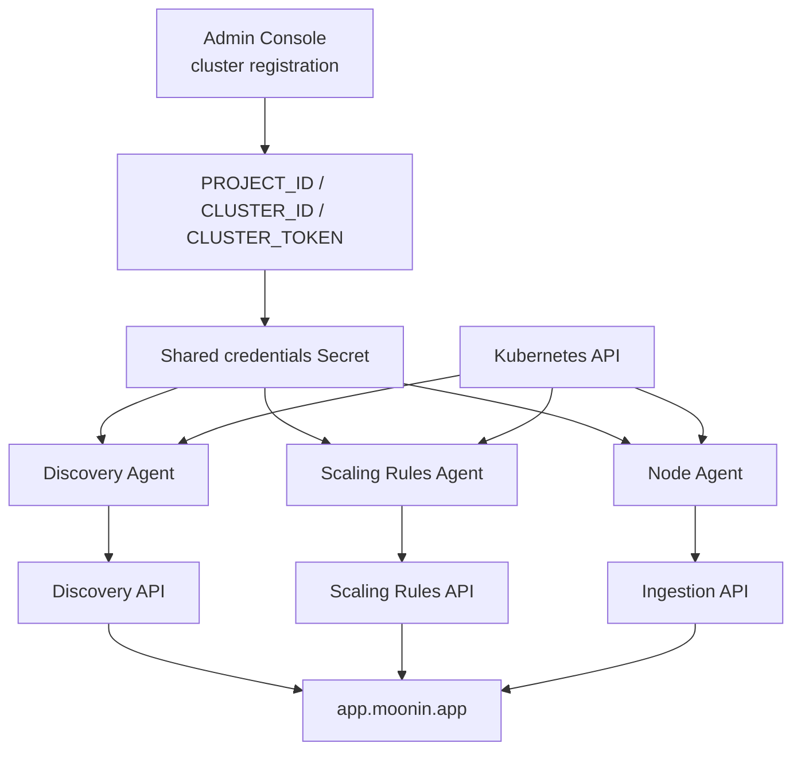

The Moonin agent bundle is the supported in-cluster package used to connect a Kubernetes cluster with Moonin. The current public chart installs three agents:

- **Discovery Agent**
- **Scaling Rules Agent**
- **Node Agent**

Public resources:

- [Moonin Agent chart repository](https://github.com/Moonin-Lab/Moonin-Agent-Chart)
- [Public Helm repository](https://Moonin-Lab.github.io/Moonin-Agent-Chart)

## Current agents at a glance

| Agent | Primary responsibility | Reads from the cluster | Writes to the cluster | Sends to Moonin |
|---|---|---|---|---|
| Discovery Agent | Inventory, topology, revisions, CronJobs, node and cluster metadata | Namespaces, nodes, pods, services, ConfigMaps, Secrets, Deployments, ReplicaSets, HPAs, Jobs, CronJobs, Ingresses, NetworkPolicies, selected RBAC objects | No workload mutations. Only leader-election `Lease` updates | Inventory, revisions, errors, CronJobs, CronJob executions, node snapshots, cluster metadata |
| Scaling Rules Agent | Temporary scaling execution through HPAs | Pods, Deployments and HPAs, plus active templates from Moonin | Creates, updates or deletes managed HPAs and may update Deployment replica counts during apply or revert | Template execution and revert events |
| Node Agent | Runtime observability for workloads running on Linux nodes | Supported runtime traffic, process signals, cgroup metrics and Kubernetes workload context | No workload mutations | Events, traces, dependencies, runtime error signals and metrics |

## How the bundle fits into the platform

## Lifecycle after installation

1. A cluster is registered in the Admin Console and receives `PROJECT_ID`, `CLUSTER_ID` and `CLUSTER_TOKEN`.
2. The Helm chart stores those values in a shared Kubernetes Secret and deploys the agents in the `moonin-agent` namespace.
3. The Discovery Agent performs a warm-up sync for namespaces, Deployments and CronJobs before switching to informer-based monitoring and periodic heartbeats.
4. The Discovery Agent keeps Moonin updated with revisions, images, HPA snapshots, CronJob execution history, node snapshots and cluster metadata.
5. The Scaling Rules Agent reconciles every 30 seconds, fetches the templates that belong to the cluster, evaluates whether they should run now, then loads their actions.
6. Active scaling actions are applied in `priority_up` order. If a target Deployment has no HPA, the agent can create a provisional managed HPA first.
7. Managed HPAs are reverted in `priority_down` order when the execution window ends or when the template is disabled before its window expires.
8. Node Agent runs on selected Linux worker nodes and sends observed runtime telemetry to Moonin, where it is available through the observability workflows in `app.moonin.app`.

## Operational model

- The public chart defaults to two Discovery Agent replicas and one Scaling Rules Agent replica.
- Node Agent is a DaemonSet: one pod is scheduled on each selected Linux worker node.
- Discovery uses leader election so only one replica performs write-side sync operations at a time.
- All agents reuse the same cluster-scoped credentials Secret.
- The Scaling Rules Agent can be disabled if the cluster should remain inventory-only.

## Documentation map

| Page | What it covers |
|---|---|
| [Agent Overview](overview/) | Runtime lifecycle and decision model for Discovery Agent and Scaling Rules Agent |
| [Data Collection](data-collection/) | What leaves the cluster, how it is derived and what is stored as execution evidence |
| [Node Agent](node-agent/) | Runtime telemetry capture, host requirements and how to explore it in `app.moonin.app` |
| [Communication Protocols](protocols/) | Credentials, API flows, polling cadence and request patterns |
| [Required Permissions](permissions/) | RBAC scope required by each agent |
| [Security Model](security/) | Secret handling, sanitization, ownership boundaries and rollback safety |
| [Limitations & Scope](limitations/) | Intended limits, best-effort behavior and what the bundle does not do |
