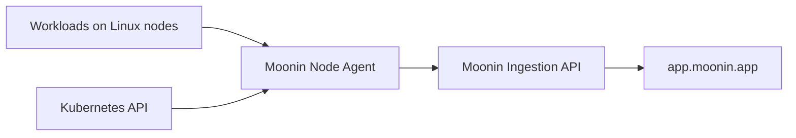

Moonin Node Agent is a Linux Kubernetes `DaemonSet` that runs on each selected worker node. It observes runtime activity with eBPF and application-runtime probes, associates it with Kubernetes workloads, and sends the resulting telemetry to Moonin.

Unlike Discovery Agent, which maintains Kubernetes inventory, Node Agent observes how workloads communicate and behave while they run. It does not modify Deployments, HPAs, or application traffic.

## What it captures

Node Agent enriches the following signals with available cluster, namespace, workload, pod, and container context:

| Signal | Examples of captured context |
|---|---|
| HTTP, HTTPS, HTTP/2 and gRPC | Method, path, protocol, status, latency, peer and workload context |
| Database activity | Connections and queries for supported PostgreSQL, MySQL, MongoDB and Redis clients |
| Google Cloud activity | Supported Pub/Sub, Firestore, Secret Manager, BigQuery, Cloud Storage, Cloud Tasks, Eventarc, reCAPTCHA and Vertex AI operations |
| Distributed traces | Server and downstream spans derived from observed requests and supported trace exports |
| Runtime errors | OOM kills, fatal signals, termination signals and non-zero process exits associated with workloads |
| Network activity | TCP state transitions and aggregated UDP activity |
| Workload metrics | CPU, memory, throttling, network and restart context collected from cgroups and `/proc` |

!!! note
    Container-log upload is disabled in the default chart. The agent can send runtime error signals, but this does not mean that all container logs are collected.

## How data reaches Moonin

The agent batches event data before sending it. By default, it aggregates events for up to 180 seconds and dispatches batches every 60 seconds. Metrics are sent every 60 seconds. Data may therefore take a few minutes to appear after activity occurs.

The platform controls collection through a remote ingestion policy. Until Node Agent obtains a valid policy, it does not send telemetry. The policy can enable or disable collection, limit it to namespaces or services, exclude scopes, and apply sampling.

## View captured data in `app.moonin.app`

Select one cluster in the top-bar cluster selector before using the observability explorers. Availability also depends on the permissions assigned to the signed-in user.

| Where | What to use it for |
|---|---|
| [`/events`](https://app.moonin.app/events) | Inspect raw HTTP, database, cache, and supported Google Cloud event families. Filter by time range, cluster, and available attributes, then expand an event for its captured context. |
| [`/traces`](https://app.moonin.app/traces) | Find a request by time, service, namespace, operation, duration, or error state. Open a trace to inspect its timeline, spans, workload context, and downstream calls. |
| [`/dependencies`](https://app.moonin.app/dependencies) | Explore observed outbound resources and identify services that consume a resource, URL, topic, bucket, or other dependency. |
| Service 360 | Open a service from the service catalog to review its `Events`, `Dependencies`, and `Metrics` tabs in the workload context. |

Typical permissions are `observability.events.view`, `observability.traces.view`, `observability.dependencies.view`, and `observability.metrics.view`.

!!! warning
    Network events are sent for platform processing but do not currently appear as a selectable family in the Events explorer. Error signals can be correlated with Moonin error workflows; they are not a substitute for a full container-log search.

## Deployment and host requirements

Node Agent is enabled by default in the Moonin Agent chart and schedules on Linux worker nodes. Control-plane nodes are excluded by default.

It requires elevated host access to attach eBPF probes and attribute activity to workloads:

- a privileged Linux container with `hostPID` and `hostNetwork`
- host mounts for `/proc`, cgroups, kubelet pod metadata, kernel modules, BPF and tracing filesystems
- read access to pods, services, endpoints, EndpointSlices, Jobs, and ReplicaSets for Kubernetes enrichment
- cluster credentials (`CLUSTER_ID` and `CLUSTER_TOKEN`) and outbound HTTPS access to the Moonin ingestion API

The chart includes a privileged init container that can set `kernel.perf_event_paranoid` to `-1` on the host when needed for eBPF performance events. Review these requirements with the cluster security owner before installation.

## Privacy and collection boundaries

- The agent excludes its own namespace and any namespaces excluded by its runtime configuration or ingestion policy.
- HTTP headers and captured request or response text are redacted for common credentials and sensitive identifiers before transmission.
- Event and metric collection is telemetry, not a traffic proxy: the agent observes supported runtime activity and does not route or modify application requests.
- Trace delivery uses a bounded local spool for retries. Other event batches are memory-buffered and can be dropped if delivery cannot be completed.

## Related documentation

- [Data Collection](data-collection/) describes the inventory collected by Discovery Agent.
- [Required Permissions](permissions/) summarizes the Kubernetes RBAC used by each agent.
- [Security Model](security/) describes credentials and agent trust boundaries.
