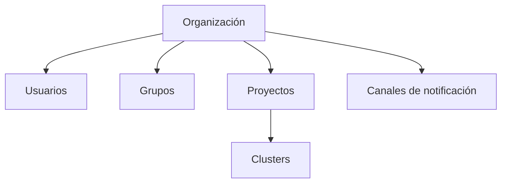
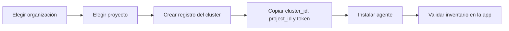

La Consola Admin es el lugar donde Moonin define tenant, acceso y recursos compartidos antes de que la app principal los consuma.

Esta página documenta el comportamiento detras de:

- `https://app-admin.moonin.app/admin/organizations`
- `https://app-admin.moonin.app/admin/organizations/<organization-id>/users`
- `https://app-admin.moonin.app/admin/organizations/<organization-id>/groups`
- `https://app-admin.moonin.app/admin/projects`
- `https://app-admin.moonin.app/admin/clusters`

## Jerarquía administrativa

## Organizaciones

Una organizacion es el límite de tenant para:

- ownership
- memberships
- roles directos y heredados por grupo
- proyectos
- clusters
- canales de notificación
- asociacion de billing
- configuración Azure AD

### Campos de organizacion

La Consola Admin soporta campos como:

- nombre
- slug
- owner email
- admin emails
- primary domain
- domains adicionales
- estado Azure AD
- Azure tenant ID
- Azure client ID
- Azure client secret
- Azure authority host

### Relacion con billing

Las organizaciones se asocian a suscripciones de billing antes de que el crecimiento de proyectos y clusters avance de forma segura. En la práctica:

- una suscripcion debe estar asignada a la organizacion
- la creación de proyectos y el onboarding de clusters dependen de esa base administrativa

## Proyectos

Los proyectos pertenecen a una sola organizacion y son la capa de agrupacion sobre los clusters.

Suelen representar:

- un equipo
- un entorno
- un dominio de negocio
- un límite operacional

Cada proyecto tiene al menos:

- nombre de proyecto
- owner
- asociacion a organizacion

Los clusters se adjuntan debajo del proyecto.

## Clusters en Admin

La pagina administrativa de clusters controla el alta y ciclo de vida del cluster. Es responsable de:

- crear el registro del cluster
- vincularlo a un proyecto
- generar credenciales de bootstrap
- rotar el token del cluster
- eliminar el registro

### Flujo de onboarding del cluster

### Rotación de token

Solo acceso organizacional elevado debería rotar tokens porque:

- el token anterior deja de ser valido
- todos los agentes en ejecución deben actualizarse
- una rotación equivocada puede interrumpir el descubrimiento del cluster

## Usuarios

La página de usuarios de la organización muestra la composición completa del acceso de una persona:

- membresia base en la organización
- estado de owner cuando aplica
- roles directos
- roles heredados por grupos
- pertenencia a grupos

### Roles de membresia

Moonin soporta las siguientes membresias base:

- `viewer`
- `editor`
- `admin`

Estas membresias son la relación base, no todo el modelo de autorización.

### Qué significa cada membresia operativamente

- `viewer` es la membresia mínima
- `viewer` sigue principio de mínimo privilegio por defecto
- `viewer` solo puede listar organizaciones por defecto
- `viewer` solo gana acceso adicional cuando un admin asigna permisos directos o heredados por grupo
- `editor` puede gestionar recursos editables de la organización
- `admin` puede gestionar recursos organizacionales
- `organization.owner` es separado y tiene control total

## Grupos

Los grupos son la forma escalable de otorgar acceso compartido a equipos.

Un grupo puede tener:

- nombre
- descripción
- miembros
- roles asignados

Cualquier rol asignado al grupo se hereda automáticamente por todos sus miembros.

Usa grupos cuando:

- varias personas necesitan el mismo acceso
- quieres que el acceso siga la pertenencia al equipo
- quieres minimizar excepciones directas por usuario

## Tipos de permisos

Moonin combina varias fuentes de permiso:

- ownership
- membership organizacional
- roles directos a usuario
- roles heredados por grupo

Los roles directos y heredados pueden representar permisos de funcionalidad como:

- ver revisiones y manifests
- acceso a errores y RCA
- administración de alert policies
- administración de event notification policies
- administración de clusters y proyectos

En otras palabras, un usuario puede tener membresia base `viewer` y solo sumar capacidades extra por roles directos o heredados asignados por un administrador.

## Canales de notificación

Los canales son recursos de la organización creados en Admin y consumidos desde la app principal.

Tipos actuales:

- Slack
- Microsoft Teams
- VictorOps

Los canales definen el destino webhook real. Las políticas después deciden cuando usarlos.

## Orden recomendado de administración

1. Crea la organización.
2. Asigna billing.
3. Configura owner, admins, domains y slug.
4. Configura Azure AD si aplica.
5. Agrega usuarios y grupos.
6. Crea proyectos.
7. Registra clusters.
8. Crea canales de notificación.
9. Recien entonces pasa a políticas y operación runtime en la app principal.
