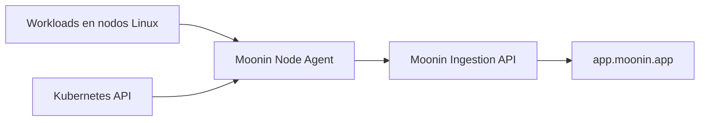

Moonin Node Agent es un `DaemonSet` de Kubernetes para Linux que corre en cada nodo worker seleccionado. Observa actividad runtime mediante eBPF y probes de runtimes de aplicacion, la asocia a workloads de Kubernetes y envia la telemetria resultante a Moonin.

A diferencia de Discovery Agent, que mantiene el inventario de Kubernetes, Node Agent observa como se comunican y se comportan los workloads mientras corren. No modifica Deployments, HPAs ni el trafico de las aplicaciones.

## Que captura

Node Agent enriquece las siguientes senales con el contexto disponible de cluster, namespace, workload, pod y contenedor:

| Senal | Ejemplos de contexto capturado |
|---|---|
| HTTP, HTTPS, HTTP/2 y gRPC | Metodo, path, protocolo, estado, latencia, peer y contexto del workload |
| Actividad de base de datos | Conexiones y queries de clientes PostgreSQL, MySQL, MongoDB y Redis soportados |
| Actividad de Google Cloud | Operaciones soportadas de Pub/Sub, Firestore, Secret Manager, BigQuery, Cloud Storage, Cloud Tasks, Eventarc, reCAPTCHA y Vertex AI |
| Trazas distribuidas | Spans de servidor y downstream derivados de requests observados y exports de trazas soportados |
| Errores runtime | OOM kills, senales fatales, senales de termino y salidas de proceso no cero asociadas a workloads |
| Actividad de red | Transiciones de estado TCP y actividad UDP agregada |
| Metricas de workloads | Contexto de CPU, memoria, throttling, red y reinicios recolectado desde cgroups y `/proc` |

!!! note
    La carga de logs de contenedor esta deshabilitada en el chart por defecto. El agente puede enviar senales de error runtime, pero esto no significa que recolecte todos los logs de contenedor.

## Como llegan los datos a Moonin

El agente agrupa los eventos antes de enviarlos. Por defecto, agrega eventos por hasta 180 segundos y despacha lotes cada 60 segundos. Las metricas se envian cada 60 segundos. Por ello, los datos pueden tardar algunos minutos en aparecer despues de ocurrir la actividad.

La plataforma controla la recoleccion mediante una politica remota de ingestion. Hasta que Node Agent obtiene una politica valida, no envia telemetria. La politica puede habilitar o deshabilitar la recoleccion, limitarla a namespaces o servicios, excluir alcances y aplicar sampling.

## Ver los datos capturados en `app.moonin.app`

Selecciona un solo cluster en el selector de clusters de la barra superior antes de usar los exploradores de observabilidad. La disponibilidad tambien depende de los permisos del usuario autenticado.

| Donde | Para que usarlo |
|---|---|
| [`/events`](https://app.moonin.app/events) | Inspecciona familias de eventos crudos de HTTP, bases de datos, cache y Google Cloud soportado. Filtra por rango de tiempo, cluster y atributos disponibles; luego expande un evento para ver su contexto capturado. |
| [`/traces`](https://app.moonin.app/traces) | Busca un request por tiempo, servicio, namespace, operacion, duracion o estado de error. Abre una traza para revisar su timeline, spans, contexto del workload y llamadas downstream. |
| [`/dependencies`](https://app.moonin.app/dependencies) | Explora recursos outbound observados e identifica servicios que consumen un recurso, URL, topic, bucket u otra dependencia. |
| Service 360 | Abre un servicio desde el catalogo de servicios para revisar las pestanas `Events`, `Dependencies` y `Metrics` en el contexto del workload. |

Los permisos habituales son `observability.events.view`, `observability.traces.view`, `observability.dependencies.view` y `observability.metrics.view`.

!!! warning
    Los eventos de red se envian para procesamiento de plataforma, pero actualmente no aparecen como familia seleccionable en el explorador de Events. Las senales de error se pueden correlacionar con los flujos de errores de Moonin; no reemplazan una busqueda completa de logs de contenedor.

## Requisitos de despliegue y host

Node Agent esta habilitado por defecto en el chart de Moonin Agent y se programa en nodos worker Linux. Los nodos control-plane se excluyen por defecto.

Requiere acceso elevado al host para adjuntar probes eBPF y atribuir actividad a workloads:

- un contenedor Linux privilegiado con `hostPID` y `hostNetwork`
- montajes de host para `/proc`, cgroups, metadata de pods de kubelet, modulos del kernel y filesystems BPF y de tracing
- acceso de lectura a pods, services, endpoints, EndpointSlices, Jobs y ReplicaSets para enriquecimiento Kubernetes
- credenciales de cluster (`CLUSTER_ID` y `CLUSTER_TOKEN`) y salida HTTPS hacia la API de ingestion de Moonin

El chart incluye un init container privilegiado que puede configurar `kernel.perf_event_paranoid` en `-1` en el host cuando es necesario para eventos de performance de eBPF. Revisa estos requisitos con el responsable de seguridad del cluster antes de instalarlo.

## Privacidad y limites de recoleccion

- El agente excluye su propio namespace y cualquier namespace excluido por su configuracion runtime o politica de ingestion.
- Los headers HTTP y el texto capturado de requests o responses se sanitizan para credenciales e identificadores sensibles comunes antes de transmitirlos.
- La recoleccion de eventos y metricas es telemetria, no un proxy de trafico: el agente observa actividad runtime soportada y no enruta ni modifica requests de las aplicaciones.
- La entrega de trazas usa un spool local acotado para reintentos. Los demas lotes de eventos se mantienen en memoria y se pueden descartar si no se logra completar el envio.

## Documentacion relacionada

- [Recoleccion de datos](data-collection/) describe el inventario que recolecta Discovery Agent.
- [Permisos requeridos](permissions/) resume el RBAC de Kubernetes que usa cada agente.
- [Modelo de seguridad](security/) describe las credenciales y limites de confianza de los agentes.
