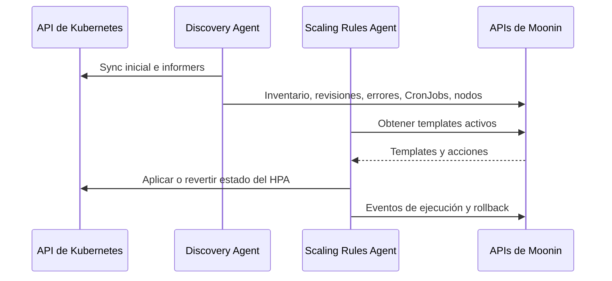

El chart actual de Moonin entrega dos controladores distintos con responsabilidades diferentes. Uno es intensivo en lectura y orientado a inventario. El otro está orientado a ejecución y solo muta recursos de escalamiento cuando un template esta activo.

## Discovery Agent

El Discovery Agent es un controlador de Kubernetes de larga duración enfocado en awareness del cluster y detección de cambios. No proxya trafico y no muta workloads.

### Secuencia de arranque

1. Carga credenciales del cluster y la URL base de la API.
2. Inicia leader election en `moonin-agent` cuando corre dentro del cluster.
3. Calienta el baseline sincronizando namespaces, Deployments y CronJobs.
4. Inicia los loops e informers de estado estable.

### Comportamiento en estado estable

| Componente | Que hace |
|---|---|
| Loop de heartbeat | Marca el cluster como conectado y refresca salud basica |
| Loop de metadata del cluster | Refresca provider, región, zona, nombre del cluster y versión de Kubernetes |
| Loop de snapshots de nodos | Captura capacidad, asignable, runtime y condiciones |
| Sync de Deployments y revisiones | Sigue Deployments, imágenes, revisiones y relaciones con HPA |
| Sync de CronJobs | Sigue definiciones de CronJob e historial de ejecución de Jobs |
| Informers | Reaccionan a cambios en Deployments, Pods, Jobs, CronJobs, HPAs, Services, Helm Secrets, Ingresses, NetworkPolicies y algunos objetos RBAC |

### Lo que produce en Moonin

- inventario de namespaces
- inventario de Deployments
- inventario de imágenes
- historial de revisiones
- señales de error de deployments
- snapshots de HPA asociados a workloads
- definiciones de CronJobs
- historial de ejecuciones de CronJobs
- snapshots de nodos
- metadata del cluster

### Modelo de revisiones

Para cambios de workloads, el agente crea registros de revisión que permiten a Moonin explicar qué cambio y cuando. Cuando el workload está gestionado por Helm, el agente deriva contexto de revisión a partir de los Secrets del release y envia una representación sanitizada en vez de los contenidos crudos del secreto.

## Scaling Rules Agent

El Scaling Rules Agent es un loop de reconciliación dedicado a cambios temporales de escalamiento. Su alcance está acotado a HPAs y a las replicas del Deployment necesarias para que esos cambios tengan efecto.

### Ciclo de reconciliación

El agente ejecuta un reconcile cada 30 segundos:

1. Obtiene los templates del cluster desde la Scaling Rules API.
2. Evalua cuáles deben ejecutarse en este momento.
3. Para cada template activo, obtiene las acciones del template para ese cluster.
4. Ordena las acciones por `priority_up`.
5. Aplica cada acción al Deployment y HPA objetivo.
6. Recorre los HPAs administrados y revierte los que expiraron o pertenecen a un template que ya no esta activo.

### Evaluación de templates

El agente soporta dos caminos de ejecución:

- **Ejecución manual** tiene prioridad cuando el backend marca una ejecución como `running`.
- **Ejecución programada** evalua la expresión cron en la timezone del template y deriva la ventana activa a partir de la última ejecución programada más la duración configurada.

El agente no ejecuta un template programado cuando:

- el template esta deshabilitado
- el template ya paso `valid_until`
- la hora actual esta fuera de la ventana activa

### Comportamiento de apply

Cuando una acción pasa a estado activo:

1. El agente carga el Deployment objetivo para conocer el baseline actual de replicas.
2. Busca un HPA que ya apunte a ese Deployment.
3. Si no existe HPA, crea primero un HPA provisional administrado.
4. Guarda como annotations el spec original del HPA y la cantidad original de replicas del Deployment.
5. Aplica los overrides de replicas minimas y maximas solicitados.
6. Si hace falta, sube inmediatamente las replicas del Deployment para cumplir el mínimo pedido.
7. Pública un evento de ejecución de vuelta a la Scaling Rules API.

### Guardas de conflicto e idempotencia

- Un HPA administrado no puede ser tomado por otro template o acción mientras exista otra ejecución administrada activa.
- Las reconciliaciones repetidas del mismo template y acción se tratan como idempotentes salvo que cambie el hash esperado.

### Comportamiento de revert

Los revert se ejecutan en orden `priority_down` y se disparan por dos razones:

- expiro la ventana de ejecución
- el template fue deshabilitado y ya no está activo para el cluster

Si el agente creo un HPA provisional, restaura las replicas originales del Deployment y elimina ese HPA durante el revert. Si el HPA existia antes de que Moonin lo tocara, el agente restaura el spec original y elimina las annotations de administración.

## Modelo de interacción del bundle

## Por que el bundle esta separado así

- Discovery puede seguir sincronizando aunque no haya automatización de scaling habilitada.
- La lógica de scaling queda aislada alrededor de ownership de HPA, rollback y ventanas de ejecución.
- La separación hace más claro el scope de permisos: discovery por un lado y mutación controlada de scaling por el otro.
