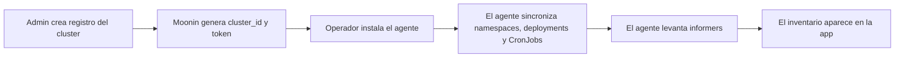

Las pantallas `Clusters` y `Nodes` explican desde dónde está recolectando datos Moonin, cómo se agrupan esos datos y si la base runtime de un proyecto esta sana.

Esta página documenta el comportamiento detras de:

- `https://app.moonin.app/clusters`
- `https://app.moonin.app/nodes`
- `https://admin.moonin.app/admin/clusters`

## Qué significa un cluster en Moonin

El registro de cluster es el puente entre el modelo administrativo y el descubrimiento runtime:

- un cluster pertenece a un solo proyecto
- un proyecto pertenece a una organización
- namespaces, deployments, services y CronJobs se descubren bajo ese cluster
- los snapshots de nodos se almacenan como inventario operativo del cluster

## Flujo de onboarding del cluster

## Qué ocurre durante el registro

1. En la Consola Admin, el operador selecciona la organización y el proyecto destino.
2. Se crea el registro del cluster con un nombre y una descripción opcional.
3. Moonin genera las credenciales de bootstrap que usara el agente.
4. El agente se instala dentro del cluster.
5. La primera sincronización envia el inventario actual de namespaces, deployments y CronJobs.
6. Luego los informers continuos mantienen al día revisiones, fallas de pods, cambios de HPA, services y ejecuciones de CronJobs.

## Que muestra la página `Clusters`

La página principal de clusters es la capa de inventario y navegación para operaciones a nivel cluster. Está pensada para responder:

- que clusters existen para los proyectos seleccionados
- qué provider y metadata cloud están disponibles
- cuántos namespaces y deployments están siendo rastreados
- si el cluster tiene contexto suficiente para construir links a la consola cloud

La información típica del cluster incluye:

- nombre y descripción
- proyecto al que pertenece
- provider cloud
- metadata de proyecto, cuenta o suscripción cuando existe
- región y zona cuando existe
- cantidad de namespaces
- cantidad de deployments
- contexto de descubrimiento Kubernetes

## Cloud metadata y deep links

Moonin enriquece los clusters con metadata del provider cuando puede inferirla de forma segura desde el entorno. Esa metadata se usa para construir links desde vistas de revisiones y clusters hacia la consola cloud.

Moonin documenta el comportamiento resultante, no las heuristicas privadas de captura:

- si la metadata del provider existe, Moonin puede mostrar links al cluster y al workload en la consola cloud
- si la metadata es incompleta, Moonin sigue rastreando el cluster localmente pero algunos links no aparecen
- la metadata cloud es contexto operativo y no reemplaza el registro administrativo del cluster

## Que muestra la página `Nodes`

La página `Nodes` es una vista snapshot por cluster que ayuda a revisar capacidad y readiness sin abrir directamente el control plane de Kubernetes.

Los datos típicos por nodo incluyen:

- readiness del nodo
- pertenencia a cluster y proyecto
- labels de zona o topologia cuando existen
- capacidad y allocatable para CPU, memoria y pods
- tipo de instancia e identificadores de runtime cuando existen
- versión de Kubernetes y kubelet cuando existen
- timestamp del bucket de captura

## Como se usa la data de nodos

La pantalla de nodos es especialmente útil para:

- validar que un cluster nuevo ya es visible para Moonin
- revisar si un incidente runtime está concentrado en un cluster o node pool
- correlacionar problemas de deployment con presión de capacidad o readiness
- confirmar a qué proyecto y cluster pertenece un nodo antes de escalar

## Permisos y límites administrativos

Hay dos planos de control diferentes:

- la app principal permite visibilidad de clusters y revisión de nodos según acceso organizacional y permisos de funcionalidad
- la Consola Admin controla alta de clusters, rotación de token y eliminación

En terminos operativos:

- owners y organization admins pueden registrar clusters y rotar tokens
- los límites entre organización, proyecto y cluster se controlan desde Admin
- la app principal se enfoca en observación, contexto de revisión y correlación de incidentes

## Rotación de token y expectativas de ciclo de vida

Los tokens de cluster son credenciales operativas de conexión para el agente.

- rotar un token invalida el token anterior
- todos los agentes que usaban el token anterior deben actualizarse
- eliminar el cluster rompe la asociación para los agentes que usaban ese token

Usa rotación cuando:

- sospechas exposición de la credencial
- tienes una política regular de rotación de seguridad
- cambia la responsabilidad operacional del cluster

## Flujo recomendado de operación

1. Crea primero el proyecto.
2. Registra el cluster desde Admin.
3. Instala el agente con las credenciales generadas.
4. Confirma visibilidad en `Clusters`.
5. Confirma inventario de nodos en `Nodes`.
6. Recién después avanza a deployments, services, CronJobs y políticas.
