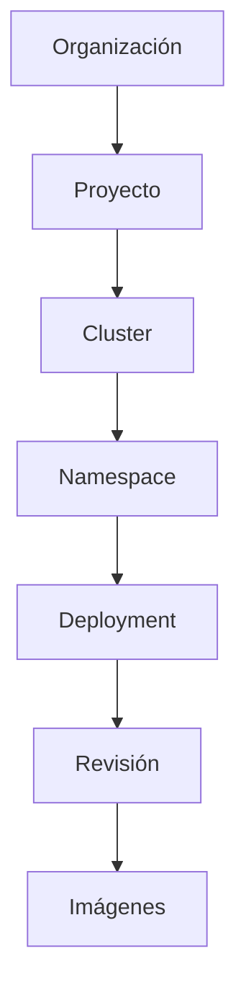
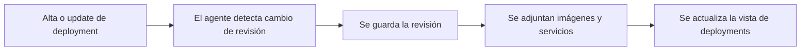

Los deployments son la unidad de cambio que alimenta la correlación de Moonin. Cada rollout puede convertirse en una revisión, cada revisión trae contexto de imagen y cada imagen puede buscarse a nivel de organización.

Esta página documenta el comportamiento detras de:

- `https://app.moonin.app/deployments`
- `https://app.moonin.app/images`

Para historial de releases y detalle de revisiones, continua con [Revisiones](../revisions/).

## Modelo de deployment

En Moonin, un deployment vive dentro de la siguiente jerarquía runtime:

## Para qué sirve la pagina `Deployments`

La pantalla de deployments es el indice operativo de workloads con historial de rollout. Sirve para responder:

- que deployments existen en el alcance seleccionado
- como se ve la revisión más reciente
- que set de imagenes esta asociado al deployment
- si existe un snapshot de HPA para la última revisión
- que cluster, namespace y proyecto son dueños del workload

## Que guarda Moonin en la vista de deployment

El listado de deployments se enriquece con la información de la última revisión conocida:

- nombre del deployment
- proyecto, cluster y namespace
- número o versión de la revisión más reciente
- timestamp del último despliegue
- tipo de revisión cuando existe
- nombres y tags de imagenes de la última revisión
- presencia de HPA y snapshot HPA cuando existe
- contexto de provider cloud y deep links cuando existen

## Como llega el dato de rollout a esta pagina

Moonin no necesita una nota manual de release para este flujo. El cambio del deployment es el evento fuente.

## Patrones de origen de revisión

Dependiendo del workload, la revisión registrada puede reflejar:

- un rollout regular del deployment
- un rollout disparado por GitOps
- contexto de release derivado de Helm

La documentación se enfoca en lo que ve el operador:

- un nuevo número de revisión
- timestamps del rollout
- imágenes relacionadas
- errores asociados si las fallas comienzan después del cambio

## Visibilidad de HPA

Para la última revisión de un deployment, Moonin puede mostrar:

- si existe HPA
- replicas minimas
- replicas maximas
- métricas y contexto del HPA cuando están disponibles
- timestamps de captura del snapshot HPA

Por eso la página de deployments es una buena entrada antes de trabajar con [Scaling Rules](../policies/).

## Para qué sirve la página `Images`

La pantalla de imágenes es un índice inverso sobre el estado más reciente de los workloads. Responde preguntas como:

- donde está corriendo este tag de imagen
- que servicios siguen usando un build antiguo
- que registry sirve la imagen
- cual es el blast radius de una imagen vulnerable

## Campos típicos en la página de imágenes

- referencia completa de imagen
- nombre corto de imagen
- tag
- nombre del contenedor
- deployment y service name
- número de revisión
- namespace, cluster y proyecto
- timestamp de despliegue
- registry extraido desde la referencia

## Flujos típicos de operación

### Validar un rollout

1. Abre `Deployments`.
2. Filtra por proyecto, cluster, namespace o deployment.
3. Confirma timestamp e imágenes de la última revisión.
4. Abre el detalle de revisión si necesitas más profundidad.

### Medir el blast radius de una imagen

1. Abre `Images`.
2. Busca por imagen completa, nombre corto o tag.
3. Revisa todos los workloads que hacen match.
4. Usa el número de revisión y la propiedad del deployment para planificar la remediación.

### Preparar una decisión de scaling o rollback

1. Abre el deployment afectado.
2. Valida el contexto HPA y el set de imágenes.
3. Compara con el historial de revisiones.
4. Continua hacia scaling rules o investigación de incidentes según corresponda.

## Relación con services

Deployments y services están relacionados pero no son lo mismo en Moonin:

- la página de deployments está orientada a cambios y rollouts
- la página de services está orientada a trafico y observabilidad

Si tu pregunta principal es "que cambio", parte por deployments. Si tu pregunta es "como se comporta este servicio en logs, eventos, métricas y dependencias", continua con [Workloads, servicios y CronJobs](../workloads/).
