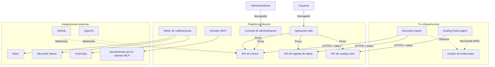
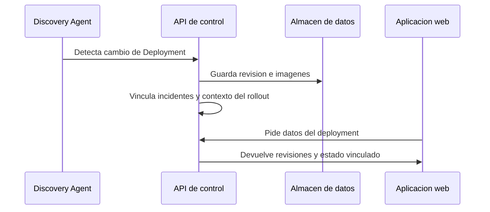
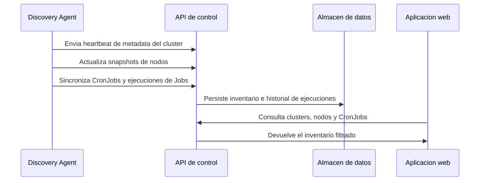
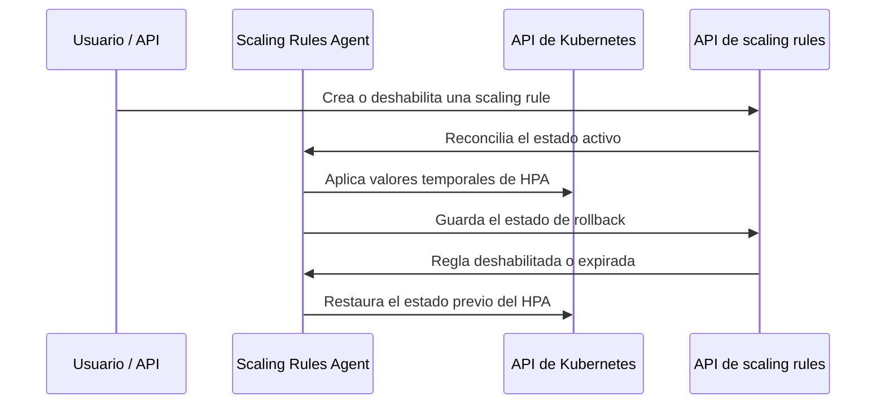

Este documento describe la arquitectura de alto nivel de Moonin con foco en los componentes visibles hoy en el producto y en el flujo publico de despliegue.

## Resumen

Moonin es una plataforma SaaS multi-tenant desplegada sobre Kubernetes. Los clientes instalan el chart `moonin-agent` dentro de sus clusters. Ese chart hoy incluye el Discovery Agent y el Scaling Rules Agent, ambos autenticados con el mismo secreto de credenciales.

## Componentes principales

### Discovery Agent

- observa Deployments, Jobs, CronJobs, HPAs, Namespaces y Services
- envia metadata de deployment, snapshots de nodos, CronJobs y cloud metadata
- usa leader election

### Scaling Rules Agent

- aplica cambios temporales de HPA
- guarda estado de rollback
- restaura los valores anteriores al vencer o deshabilitar la regla

### API de control

Centraliza seguimiento de deployments, clusters, CronJobs, politicas, administracion y billing.

### Aplicacion principal

Entrega:

- overview
- clusters, nodos y namespaces
- deployments, revisiones e imagenes
- CronJobs y ejecuciones
- errores, notificaciones y politicas

### Consola de administracion

Administra:

- organizaciones y usuarios
- proyectos y registro de clusters
- canales de notificacion
- billing

### Motor de notificaciones

Un worker en segundo plano que evalua las alert policies y las event notification
policies, y despacha las notificaciones a los canales configurados con horarios,
control de ritmo y silencios.

## Flujos de datos

### Seguimiento de deployments

### Inventario de cluster y flujo de CronJobs

### Ejecucion de scaling y rollback

## Modelo de autenticacion

- los usuarios se autentican con Google OAuth o con correo y contrasena
- los agentes se autentican con un token propio del cluster
- las aplicaciones web hacen proxy de las llamadas al backend del lado del servidor
- el servidor MCP expone tokens de acceso de solo lectura y con alcance acotado

## Modelo de almacenamiento

- la metadata de organizaciones, proyectos, clusters, revisiones, snapshots de nodos
  y CronJobs se guarda en una base de datos relacional
- los extractos de log de los CronJobs que fallan se guardan junto al registro de la
  ejecucion
- las metricas agregadas y los resumenes se guardan aparte para que los tableros
  respondan rapido

## Aspectos de seguridad

- toda la comunicacion de los agentes usa HTTPS
- los tokens de cluster se comparan en tiempo constante
- el navegador nunca recibe tokens internos de la API
- los manifiestos sanitizados conservan la identidad de los recursos, como el nombre
  de un Secret, y ocultan solo los valores sensibles
