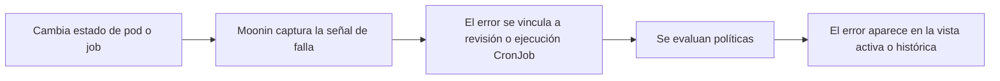
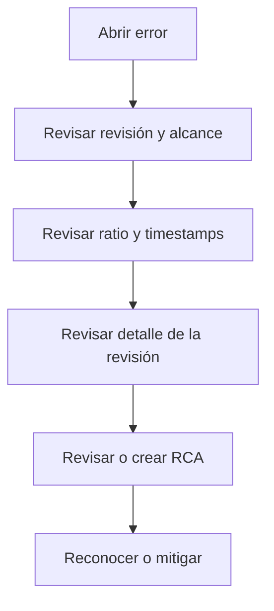

Moonin registra fallas runtime con contexto de workload y de rollout, de modo que la investigación parte desde una revisión y no desde un log aislado.

Esta página documenta el comportamiento detras de:

- `https://app.moonin.app/errors`
- `https://app.moonin.app/errors/history`

## Vista activa versus histórica

- `Errors` es la cola operativa para issues actuales o recientes que aun requieren revisión.
- `Errors History` agrega un rango de fechas más amplio para postmortem, tendencias y auditoria.

Ambas páginas usan los mismos filtros jerarquicos:

- proyecto
- cluster
- namespace
- deployment

## Como un error se vuelve visible

## Familias de error capturadas actualmente

Moonin captura múltiples condiciones de falla para revisiones de deployment, incluyendo:

- `CrashLoopBackOff`
- `ImagePullBackOff`
- `ErrImagePull`
- `ErrImageNeverPull`
- `CreateContainerConfigError`
- `CreateContainerError`
- `RunContainerError`
- `ContainerCannotRun`
- `InvalidImageName`
- `CreatePodSandboxError`
- `CreateContainerSandboxError`
- `NetworkPluginNotReady`
- `PodFailed`
- `OOMKilled`
- `Error`
- `DeadlineExceeded`
- `Failed`
- `Unknown`
- `Pending`
- `Evicted`
- `Unschedulable`
- `ContainersNotReady`
- `NotReady`
- `NotInitialized`
- `Restarts`
- variantes de init containers como `Init:CrashLoopBackOff` y `Init:OOMKilled`

Las fallas de CronJob se rastrean por separado mediante historial de ejecuciones y pueden incluir:

- estado del job
- exit code
- failure reason
- failure message
- extractos de logs cuando existen

## Qué contiene un registro de error

Un error de revisión puede incluir:

- tipo de error
- mensaje legible
- detalles estructurados
- severidad
- pods afectados
- total de pods
- ratio afectado
- momento de ocurrencia
- estado mitigado
- timestamp de mitigacion
- revisión y alcance del workload relacionado

Por eso Moonin puede evaluar políticas por umbral y no limitarse a mandar todas las fallas iguales.

## Flujo de investigacion

## Diferencia entre acknowledge y mitigate

Estas acciones no son equivalentes:

- `Acknowledge` se usa cuando una alerta ya fue disparada y un operador esta tomando ownership
- `Mitigate` se usa cuando el equipo considera que el error ya fue tratado desde la perspectiva operativa de Moonin

En la práctica:

- el acknowledge esta ligado a workflows de alerta
- la mitigación afecta como se trata el issue en la revisión operativa y en el seguimiento de políticas

## Flujo de RCA

La revisión de errores en Moonin es consciente de la revisión:

- el detalle del error puede cargar la revisión relacionada
- la revisión aporta contexto de rollout, imagenes, servicio y provider
- las notas RCA y los asistentes de análisis pueden adjuntarse cuando el permiso lo permite

El punto importante para el usuario es que el RCA parte desde hechos runtime capturados, no desde una página vacia.

## Como usan los errores las políticas

Las alert policies evalúan errores runtime usando:

- organización
- path y alcance
- tipo de error
- ratio afectado
- delay
- ventana de silencio
- estado enabled
- ventanas horarias UTC de los canales

Consulta [Políticas y gobernanza](../policies/) y [Notificaciones](../notifications/) para el comportamiento de entrega.

## Flujo recomendado de incidentes

1. Parte por `Errors` para la respuesta operativa activa.
2. Abre la revisión relacionada antes de asumir la causa raiz.
3. Usa el ratio afectado para separar fallas localizadas de fallas amplias.
4. Revisa si una política debio haber notificado al equipo correcto.
5. Usa `Errors History` para retrospectivas y patrones repetidos.
