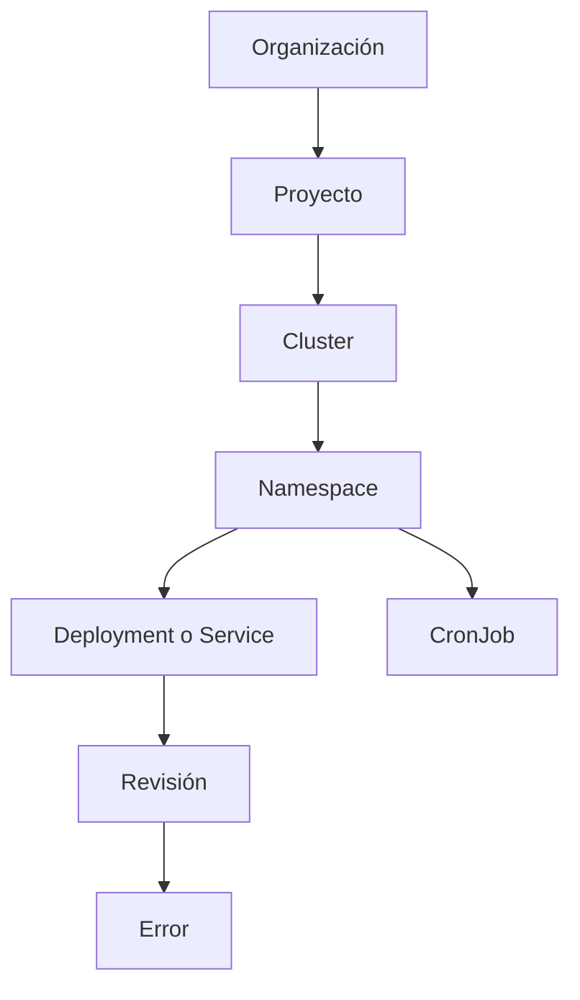
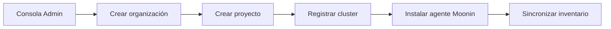
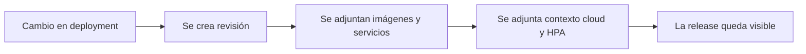
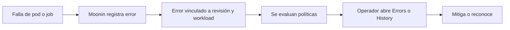
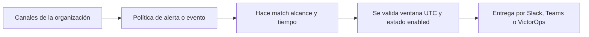

<section class="moonin-docs-hero">
  
Documentación de Moonin

  <h1>Opera Kubernetes con contexto, no a ciegas.</h1>
  
Aprende cómo Moonin conecta el inventario del cluster, los deployments, las revisiones, los incidentes y las notificaciones en un solo espacio de operación.

  

    <a href="getting-started/">Empezar</a>
    <a href="../">View documentation in English</a>
  

</section>

Moonin es una plataforma de operaciones para Kubernetes centrada en cinco trabajos conectados:

- modelar la jerarquía runtime del estate
- seguir cada rollout como una revisión
- capturar fallas runtime con contexto de cambio
- enrutar notificaciones usando políticas reutilizables
- gobernar acceso, clusters y canales desde una sola capa administrativa

Esta documentación está escrita para que un operador pueda pasar desde el onboarding hasta la operación diaria sin depender de conocimiento oculto del producto.

## Que conecta Moonin

Moonin es una plataforma de operaciones para Kubernetes centrada en cinco trabajos
conectados:

- modelar la jerarquía de runtime de tu parque
- registrar cada rollout como una revisión
- capturar las fallas de runtime con el contexto del rollout
- enrutar las notificaciones a traves de policies reutilizables
- mantener gobernados desde un solo lugar el acceso, los clusters y los canales

Esta documentación está escrita para que un operador pueda ir del alta a la operación
diaria sin depender de conocimiento de producto que no este escrito.

## Entradas por idioma

| Idioma | Punto de inicio |
|---|---|
| Español | [Introducción y recorrido](getting-started/) |
| English | [English docs](../getting-started/) |

## Jerarquía de recursos

El modelo mental principal de Moonin es jerarquico. La mayoria de las pantallas, filtros y permisos siguen esta cadena:

## Qué significa cada nivel

- `Organizacion` es el límite de tenant para usuarios, grupos, billing, canales, políticas y SSO.
- `Proyecto` agrupa clusters que pertenecen al mismo dominio de negocio, equipo o entorno.
- `Cluster` es el objetivo Kubernetes registrado y conectado por el agente de Moonin.
- `Namespace` delimita workloads dentro del cluster.
- `Deployment` es la unidad de cambio que Moonin correlaciona con revisiones y errores.
- `Service` es la vista orientada a trafico y observabilidad del workload.
- `Revision` es el snapshot inmutable creado por un rollout.
- `CronJob` es la unidad de ejecución programada, separada del historial de revisiones.

## Flujos nucleares del producto

### 1. Dar de alta y descubrir

### 2. Seguir un rollout

### 3. Investigar un incidente

### 4. Notificar al canal correcto

## Modelo de acceso resumido

Moonin combina membresia base con roles finos:

- `organization.owner` tiene control total de la organización.
- Las membresias base son `viewer`, `editor` y `admin`.
- `viewer` es el rol mínimo y sigue mínimo privilegio por defecto.
- Por defecto `viewer` puede listar organizaciones y depende de permisos asignados por un admin para obtener acceso adicional.
- Los roles directos a usuario pueden agregar permisos específicos por funcionalidad.
- Los roles heredados por grupo permiten compartir acceso sin editar usuario por usuario.
- Algunas pantallas además exigen permisos puntuales como ver revisiones, revisar RCA, editar políticas o administrar clusters.

El modelo completo está documentado en [Administración](administration/) y [Azure AD](integrations/azure-ad/).

## Mapa de documentación

| Necesidad | Página |
|---|---|
| Entender releases, revisiones y contexto de rollout | [Revisiones](revisions/) |
| Operar deployments e inventario de imágenes | [Deployments e imágenes](deployments/) |
| Operar clusters y nodos | [Clusters y nodos](clusters/) |
| Entender servicios, CronJobs e historial de ejecuciones | [Workloads, servicios y CronJobs](workloads/) |
| Investigar fallas activas e historicas | [Errores e incidentes](incidents/) |
| Configurar canales y entender la entrega | [Notificaciones](notifications/) |
| Configurar alertas, eventos y automatización de scaling | [Políticas y gobernanza](policies/) |
| Gestionar organizaciones, proyectos, usuarios, grupos y clusters | [Administración](administration/) |
| Configurar Microsoft Entra ID por organización | [Azure AD](integrations/azure-ad/) |
