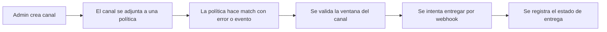

Moonin separa la entrega de notificaciones en dos capas:

- canales de notificación propiedad de la organización
- políticas que deciden cuando esos canales se usan

Esta página documenta el comportamiento detras de:

- `https://app.moonin.app/event-notification-policies`
- la gestión de canales en `https://app-admin.moonin.app/admin/organizations/<organization-id>/notification-channels`

El matching específico de alertas se describe en [Políticas y gobernanza](../policies/).

## Tipos de canal soportados

Moonin soporta actualmente:

- Slack
- Microsoft Teams
- VictorOps

## Donde se crean los canales

Los canales se crean en la Consola Admin a nivel de organización. Un canal pertenece a una organización y luego puede adjuntarse a políticas dentro de la app principal.

Las configuraciones tipicas por tipo son:

- `Slack`: incoming webhook URL y un label de canal opcional
- `Microsoft Teams`: incoming webhook URL
- `VictorOps`: webhook URL

Cada canal también puede estar habilitado o deshabilitado globalmente.

## Modelo de entrega

## Ventanas y horarios por canal

Las políticas pueden definir ventanas activas por canal usando:

- días activos
- hora de inicio en UTC
- hora de fin en UTC

Eso significa:

- el mismo canal puede estar activo para una política y no para otra
- la evaluación se hace contra ventanas UTC y no contra la hora local del navegador
- si no configuras horario, el canal se considera siempre elegible para esa política

## Estado enabled y reintentos

Antes de entregar, Moonin revisa varias condiciones:

- la política debe estar habilitada
- el canal debe estar habilitado
- la política no debe estar silenciada para el tiempo evaluado
- el canal debe estar dentro de su ventana activa

Operativamente:

- si el canal no es elegible en ese momento, Moonin evita tratarlo como envio exitoso
- los envios de eventos guardan estado para permitir retry cuando corresponde
- los envios de alerta también guardan estado de procesamiento para evitar duplicados ciegos

## Estados de entrega que conviene entender

Moonin registra internamente el progreso de la entrega para que puedas razonar sobre que paso:

- `processing` significa que el envio está en cola o en curso
- `alerted` significa que el envio fue entregado
- los flujos de alertas también pueden pasar por estados como `resolved` o `acknowledged`

La UI exacta puede variar según la pantalla, pero el significado operativo es el mismo.

## Que se entrega

Existen dos familias distintas de notificación:

- `Alert notifications` guiadas por errores runtime y alert policies
- `Event notifications` guiadas por eventos de ciclo de vida

La familia de eventos hoy incluye al menos:

- `deployment.revision.created`

Eso significa que Moonin puede notificar a un equipo cuando se crea una nueva revisión incluso si todavia no existe una falla.

## Qué contiene una notificación

Según el canal y el tipo de política, la entrega puede incluir:

- contexto de proyecto, cluster, namespace y servicio
- número de revisión
- nombre de la política que hizo match
- affected ratio en el caso de alertas
- path del evento en notificaciones de revisión creada
- links de retorno a Moonin para RCA o revisión

## Patron practico de operación

1. Crea los canales una sola vez en Admin.
2. Nombralos por equipo o por propósito de escalamiento.
3. Usa horarios por política en vez de duplicar canales para turnos.
4. Prefiere deshabilitar un canal antes que borrarlo si necesitas una pausa temporal.
5. Valida las notificaciones junto con el diseño de alcance, no como una configuración aislada.
