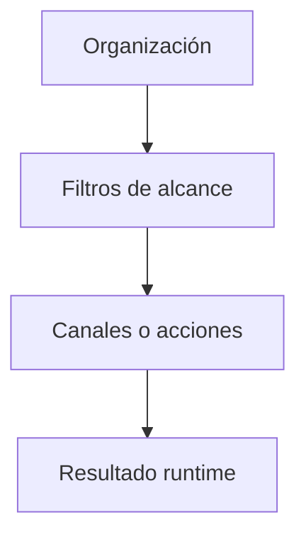
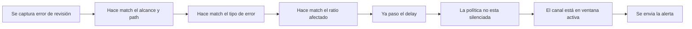
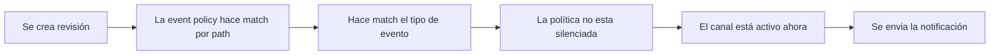
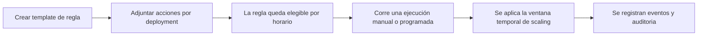

La gobernanza en Moonin se construye sobre tres familias de políticas operativas:

- alert policies
- event notification policies
- scaling rules

Esta página documenta el comportamiento detras de:

- `https://portal.moonin.app/alert-policies`
- `https://portal.moonin.app/event-notification-policies`
- `https://portal.moonin.app/scaling-rules`

## Jerarquía de políticas

Las tres familias heredan el límite de organización y luego acotan el alcance mediante path y contexto del workload.

## Alert policies

Las alert policies son guiadas por errores. Evalúan errores capturados de revisiones de deployment y deciden si debe enviarse una notificación.

### Inputs de una alert policy

Una alert policy puede combinar:

- nombre y descripción
- estado enabled
- uno o más tipos de error
- affected ratio mínimo
- matching por path
- alcance por proyecto, cluster, namespace o deployment
- ventana de silencio
- delay en segundos
- uno o más canales
- ventanas UTC por canal

### Como funciona el matching de alertas

### Qué significa el delay

El delay evita alertar de inmediato ante fallas demasiado frescas. Moonin espera a que transcurra la cantidad de segundos configurada desde la ocurrencia del error antes de enviar.

Usa delay cuando:

- el error suele ser transitorio durante startup
- quieres reducir ruido por turbulencia corta durante el rollout

### Qué significa el affected ratio

El affected ratio refleja qué tanto del workload esta impactado. Esto permite distinguir:

- un pod inestable dentro de un rollout más grande
- una falla amplia que afecta a la mayor parte del servicio

## Event notification policies

Las event notification policies no dependen de errores. Sirven para enrutar eventos de ciclo de vida al canal correcto.

### Inputs de una event policy

Una event policy puede combinar:

- nombre y descripción
- estado enabled
- tipos de evento
- matching por path
- ventana de silencio
- uno o más canales
- ventanas UTC por canal

### Modelo de eventos actual

El flujo documentado actual incluye:

- `deployment.revision.created`

Eso hace que las event policies sean útiles cuando el equipo quiere enterarse de un despliegue incluso antes de que exista un incidente.

### Flujo de evaluacion de eventos

## Scaling rules

Las scaling rules son acciones runtime programadas o manuales diseñadas para sobreescribir temporalmente el comportamiento de escalado de un servicio de forma controlada y auditable.

### Qué contiene una scaling rule

- nombre
- descripción
- cron expression
- timezone
- duracion opcional en minutos
- fecha opcional de expiracion
- estado enabled
- información del creador
- una o más acciones de scaling asociadas a deployments

### Qué contiene una acción de scaling

Para cada deployment seleccionado, Moonin puede guardar:

- proyecto
- cluster
- namespace
- deployment
- replicas minimas
- replicas maximas
- replicas por defecto
- contexto HPA cuando existe

### Flujo de scaling rules

### Comportamiento de duración y expiración

- `duration_minutes` controla cuanto tiempo permanece activa una ejecución
- `valid_until` define la última fecha en que la regla se considera valida
- una regla puede ejecutarse por horario o manualmente
- la ejecución manual puede crearse y cancelarse por separado del template

### Para que suelen usarse

- preparar picos de trafico
- bajar capacidad después de una ventana conocida
- coordinar scaling temporal durante mantenimiento o releases
- documentar que deployments se están escalando intencionalmente y cuanto

### Auditabilidad

Las scaling rules incluyen vistas de apoyo para:

- revisión de acciones
- historial de eventos
- historial de auditoria
- estado de ejecuciones manuales

Toma esas pantallas como la fuente operativa de verdad para el scaling temporal planificado.

## Como elegir la familia correcta

Usa `Alert Policies` cuando el disparador es una falla.

Usa `Event Notification Policies` cuando el disparador es un evento operativo, por ejemplo una nueva revisión.

Usa `Scaling Rules` cuando el resultado deseado es un cambio temporal de scaling y no una notificación.
