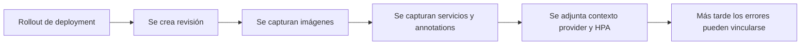
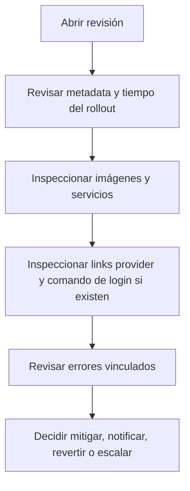

La experiencia de `Releases` en Moonin esta construida sobre revisiones. Una revisión es el checkpoint operativo inmutable creado para un rollout de deployment.

Esta página documenta el comportamiento detras de:

- `https://portal.moonin.app/releases`

## Por que existen las revisiones

Las revisiones permiten responder rápido la pregunta más difícil de la operación diaria:

> Este problema comenzo porque el workload cambio, o comenzo mientras el workload seguia igual?

Moonin resuelve eso adjuntando fallas, imágenes, contexto cloud y estado HPA a un registro concreto de rollout.

## Ciclo de vida de una revisión

## Qué contiene una revisión

Una revisión puede incluir:

- identificador y número de revisión
- identificador del deployment y service name
- contexto de namespace, cluster y proyecto
- timestamps de creación y actualizacion
- estado
- reviewer o actor cuando existe
- notas del rollout cuando existen
- deployment annotations y pod annotations
- imagenes usadas por la revisión
- referencias de servicios detectados
- snapshot HPA cuando existe
- metadata cloud y links al provider cuando existen
- errores runtime vinculados

## Para qué sirve la pagina `Releases`

La pagina de releases es el listado filtrable del historial de revisiones dentro del alcance seleccionado. Ayuda a:

- revisar rollouts recientes
- acotar el blast radius de un cambio riesgoso
- comparar un deployment con otros cambios recientes
- saltar desde una revisión hacia imagenes, services, clusters o errores

## Flujo de detalle de revisión

Cuando un operador abre una revisión, la idea es pasar de un rollout genérico a un diagnostico accionable:

## Contexto del provider dentro de la revisión

Si existe metadata cloud para el cluster, el detalle de revisión puede exponer:

- badge del provider
- links al cluster y al namespace
- links al workload
- links a YAML o detalles cuando el provider lo soporta
- un comando de login para llegar al cluster

Estas son ayudas operativas. La revisión sigue siendo valida aunque falten links cloud.

## Contexto de imágenes y servicios dentro de una revisión

El detalle de revisión es donde el contexto de cambio se vuelve explicito:

- el set actual de imágenes muestra exactamente qué se desplego
- los sets anteriores permiten identificar qué contenedor cambio
- los servicios detectados muestran que objetos de trafico están amarrados a la revisión

Por eso las revisiones son el mejor puente entre `Deployments`, `Images`, `Services` y `Errors`.

## Errores asociados a una revisión

Los errores no se guardan aislados. Cuando Moonin captura una falla runtime para un deployment, la vincula con la revisión correspondiente para responder:

- que rollout abrio la ventana del problema
- que set de imágenes estaba activo
- que fracción de pods fue afectada
- si una política debería haber notificado

Consulta [Errores e incidentes](../incidents/) para el modelo detallado de fallas.

## Flujos típicos de operación

### Validar la última release

1. Abre `Releases`.
2. Filtra por proyecto, cluster, namespace o deployment.
3. Abre la última revisión.
4. Confirma tiempo de rollout, imágenes y estado.

### Correlacionar una falla con un cambio

1. Abre una revisión desde `Releases` o desde un error.
2. Revisa el tiempo del rollout y el cambio de imágenes.
3. Abre los errores vinculados.
4. Compara con el último estado sano conocido.

### Preparar un rollback o una respuesta de scaling

1. Abre la revisión afectada.
2. Confirma el alcance exacto del workload.
3. Revisa el contexto HPA y el set de imágenes.
4. Continua hacia scaling rules, mitigación de errores o tu tooling de despliegue.

## Expectativas de acceso

El acceso a revisiones puede ser más amplio o más restringido según roles organizacionales y permisos finos. En la práctica suelen separarse:

- visibilidad de revisiones
- visibilidad de manifests
- visibilidad de errores
- creación y revisión de RCA

Si un usuario puede abrir releases pero no ver ciertos detalles sensibles, normalmente se debe a permisos faltantes y no a un problema de datos.
